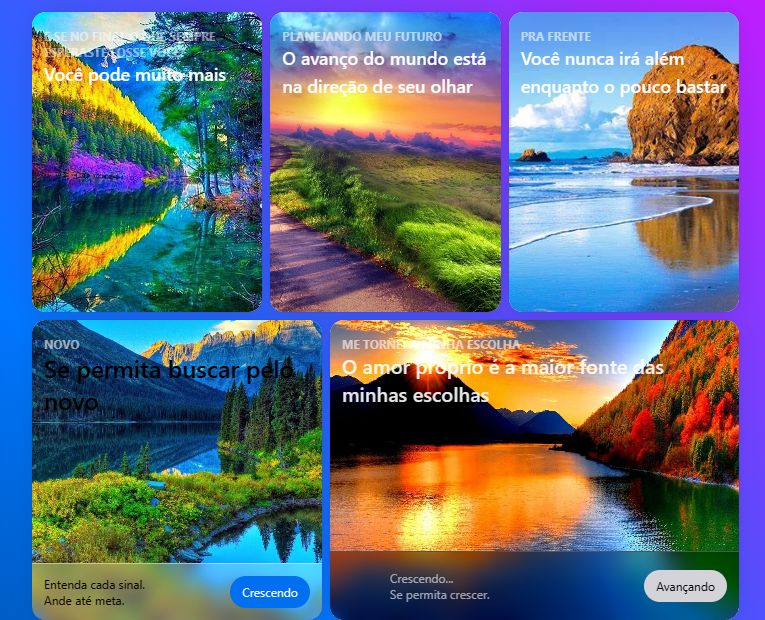

# Beautiful Nature Cards



Este é um projeto que visa mostrar a beleza da natureza por meio de cards responsivos. Os cards exibem imagens e informações relacionadas à natureza e ao meio ambiente.

## Tecnologias Utilizadas

- [Vite](https://vitejs.dev/): Um construtor de aplicativos web rápido que oferece uma experiência de desenvolvimento de última geração.
- [Tailwind CSS](https://tailwindcss.com/): Um framework de CSS utilitário altamente configurável que permite criar estilos rapidamente.
- [Next UI](https://nextui.org/): Uma biblioteca de componentes de IU para React com uma ampla variedade de componentes personalizáveis.


## Como Usar

1. Clone o repositório:

   ```bash
   git clone https://github.com/seu-usuario/beautiful-nature-cards.git
